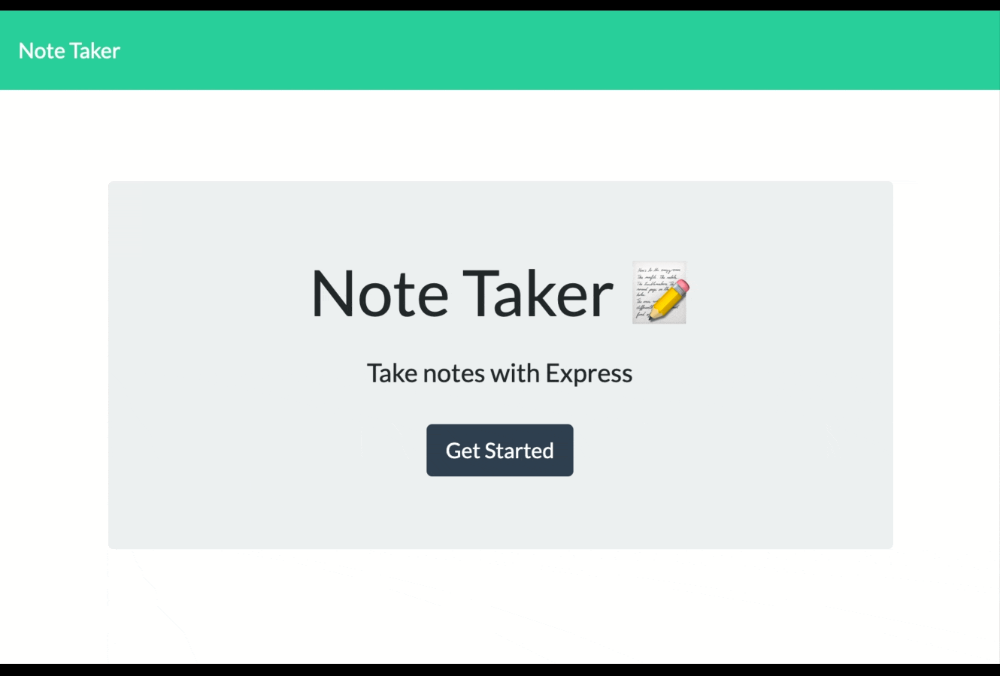

# Note Taker App

 

   

https://boiling-journey-74250.herokuapp.com/

## Description 
This is an application where a user can write, save and delete notes. The application uses an express backend ans save and retrieve note data from a json file.

## Table of Contents
- [Installation](#installation)
- [Usage](#usage)
- [License](#license)
- [Contributing](#contributing)
- [Tests](#tests)
- [Questions](#questions)

## Installation

To install use the following command

> npm i

## Usage
- Follow the command for installation. Make sure `Express` and `UUID` have been installed

- To start the program run `node server.js` from the command line and then navigate to the clickable local host link provided.

- Click the save button after writing a note to save it to the side panel
- Click in previous notes to view their content
- Click on the pencil to start a new note
- Click on the trash can to delete a note

## License

MIT

## Tests

To run tests use the following command 

> test

## Questions

Have any questions? Reach out to me at katiecampbell21@outlook.com

